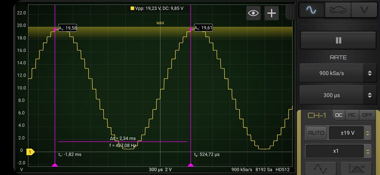

# DAC sinewawe audioplayer
## project name: mbed6_DAC_sinewave
Tested by: **Keil Studio** 1.5.55 and **Mbed-OS** 6.16.0

Plays sinewave audio on a NUCLEO-F446RE card by using the DAC 
output at PA_4 pin.

The calculated sinwave audiosamples are stored in an uint16_t array.

## Timing:
We have 36 samples for a complete sine wave therefore we have to play
440*36 samples in one second (i.e. there is a 63 us delay between each sample).

**Note:** Due to the lazy timing (wait_us() instead of hardware timing) 
the frequency is domewhat lower than the nominal value (427 Hz instead of 440 Hz). 
This is quite understandable, since we did not take into account the execution time
of the instructions in the endless loop. 

### Reference: 
[AnalogOut class reference](https://os.mbed.com/docs/mbed-os/v6.15/apis/analogout.html) 

## Hardware requirements
* NUCLEO-F446RE development board
* Active speaker or oscilloscope connected to the PA_4 pin (this is the pin labeled as A2 on the board)

## mbed6_DAC_sinewave results

For the sake of simplicity we used only 36 samples for the whole sinewave
therefore the shape of the signal is distinctly stepped

**Note:** The vertical scale is in arbitrary units, actually the value of 20.0 corresponds to 3.3 V.